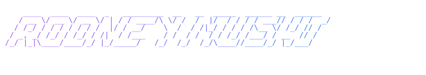

  

I'm Rodney Renatus Mushi, a student in Swinburne Univeristy of Technology. 
Curently a second year in Bachelor of Engineering (Honours) (Robotics and Mechatronics)/Bachelor of Computer Science. 
A front end developer studying react.js with the intent of becoming a full stack developer as well as an Artificial Intelligence Engineer.

## 🌐 Socials:
 

# 💻 Tech Stack:
        

<!-- Proudly created with GPRM ( https://gprm.itsvg.in ) -->
<!--
**rodneyrenatus/rodneyrenatus** is a ✨ _special_ ✨ repository because its `README.md` (this file) appears on your GitHub profile.

Here are some ideas to get you started:

- 🔭 I’m currently working on ...
- 🌱 I’m currently learning ...
- 👯 I’m looking to collaborate on ...
- 🤔 I’m looking for help with ...
- 💬 Ask me about ...
- 📫 How to reach me: ...
- 😄 Pronouns: ...
- ⚡ Fun fact: ...
-->
